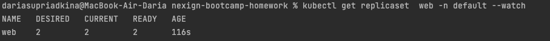

## Docker 

#### Сборка Docker Image

``docker build -t dordidora/web:1.0.0 -t dordidora/web:1.0.0 .``

В выводе нам необходимо обратить внимание на строчку:

`` => => writing image sha256:5a0ccce4e85d61263731af11b5a395fd0604e94facf337e6815948b776c4d92d``

Здесь указан Image ID, который необходим нам для запуска контейнера.
В данном случае Image ID = 5a0ccce4e85d61263731af11b5a395fd0604e94facf337e6815948b776c4d92d

#### Запуск контейнера 
``docker run -ti -p 8000:8000 --name=web 5a0ccce4e85d61263731af11b5a395fd0604e94facf337e6815948b776c4d92d``

Теперь на порту [localhost:8000](http://localhost:8000) нам доступна страница, содержащая строчку 
"Hello world of docker and kubernetes!"

#### Выложим image на Docker Hub

``docker push dordidora/web:1.0.0``

## Kubernetes

#### Запуск кластера с помощью minikube

``minikube start --embed-certs``

#### Применим manifest 

``kubectl apply -f podmanifest.yaml``

#### Контроль установки replicaset 

``kubectl get replicaset  web -n default --watch``

#### kubectl describe pod web 

Результат команды ``kubectl describe pod web`` размещен в отдельном файле с названием *kubectl_describe_pod_web*

#### Обеспечение доступа к web-приложению внутри кластера

Для достижения данной цели воспользуемся командой *kubectl port-forward*:

``kubectl port-forward replicaset/web 8080:8000``

Теперь приложение доступно нам по адресу [localhost:8080](http://localhost:8080)

